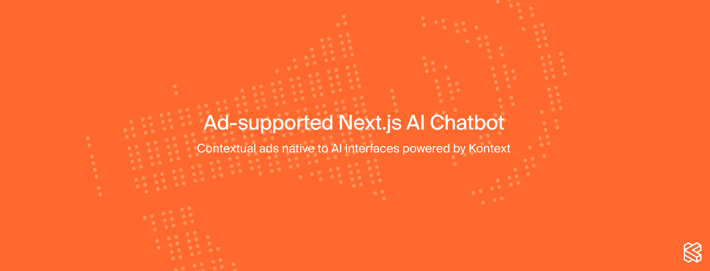
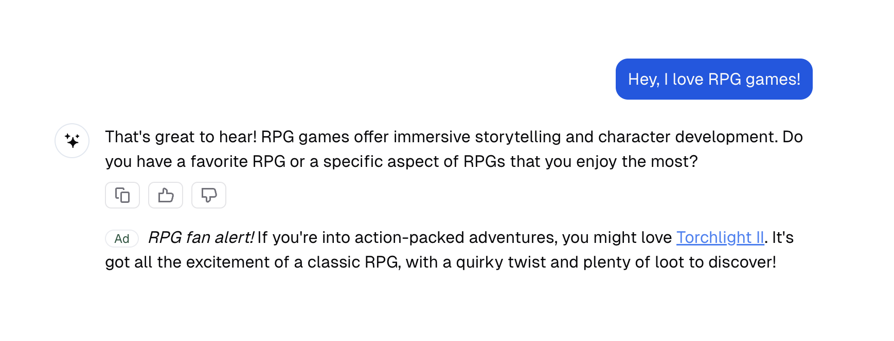

<a href="https://www.kontext.so/publishers">
  
</a>
<h1 align="center">Ad-supported Next.js AI Chatbot</h1>

<p align="center">
  A template that integrates Kontext advertisements into the <a href="https://vercel.com/templates/next.js/nextjs-ai-chatbot">Next.js AI Chatbot</a>
</p>

<p align="center">
  <a href="https://www.kontext.so/publishers"><strong>Kontext Homepage</strong></a> ·
  <a href="https://docs.kontext.so/"><strong>Kontext Docs</strong></a>
</p>

### How it works

- Real-time analysis
  - We analyze each user session in real time, without the need for keywords.
- Contextual matching
  - We match user context with the most relevant products, brands, or entertainment content.
- Native ad generation
  - Our platform creates contextual, native advertisements tailored to each user session, ensuring maximum relevance and engagement.



<p align="center">
  Example of Kontext ads in the chat interface
</p>

### Running this repository

1. Follow the instructions to [deploy & run the Next.js AI Chatbot](https://vercel.com/templates/next.js/nextjs-ai-chatbot)

2. To run Kontext ads, you will need a token from Kontext. You can get one by [getting in touch with us](https://docs.kontext.so/quickstart#1-create-an-account).

3. You will need to install the Kontext SDK.

```bash
npm install @kontextso/sdk
```
4. [Initialize the AdsProvider by following these instructions](https://docs.kontext.so/quickstart#initialize-adsprovider) in the `chat.tsx` file.

5. Include your first format, such as [an InlineAd](https://docs.kontext.so/quickstart#3-show-your-first-ad) in the `Messages` component.
